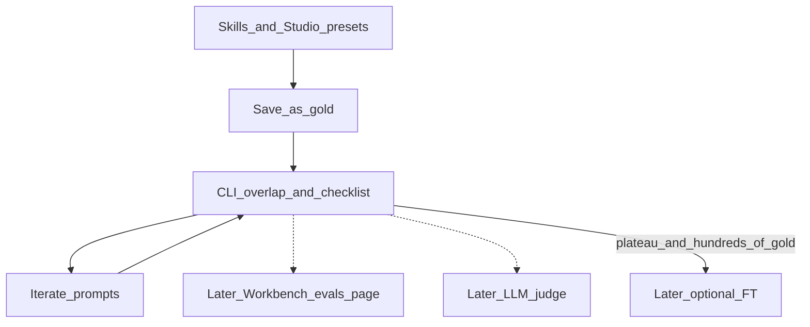

# Studio eval harness — now vs later

**Status:** Thin slice is in production code. Do not build UI, LLM-as-judge, or fine-tuning until gold volume exists and prompt/skill changes stop moving holdout scores.

**Related:** [`docs/roadmap.md`](roadmap.md) §11 · Studio [`/workbench/studio`](../frontend/app/workbench/studio/page.tsx)

## Shipped (do not rebuild)

| Piece | Where |
|-------|--------|
| Gold table | `ai_eval_cases` (Alembic `20260911_0017`) |
| Redact emails/phones | [`backend/app/ai/eval.py`](../backend/app/ai/eval.py) |
| Save as gold | Studio button + auto-save on promote to template/campaign · `POST /api/v1/workbench/ai/studio/gold` |
| Split | Every 5th case `holdout`, else `dev` |
| CLI | `python -m app.scripts.run_eval` → gitignored `backend/evals/latest.json` |
| Scores | Token overlap F1 vs gold + offer checklist from Titan offers (fail invented FDA/warranty claims) |
| Task | **Email / Studio only** |

Quality lever for the next few weeks is still [`titan-offers.md`](../backend/app/ai/skills/titan-offers.md) and Studio presets, not a model adapter.

## Later — reopen when needed

| Item | When |
|------|------|
| `/workbench/evals` owner page | Enough gold cases that listing/running from CLI is painful (~50+) |
| LLM-as-judge (same OpenRouter key, holdout only) | Lexical + checklist scores are stable and still disagree with staff taste |
| Briefing / social / agent evals | Email gold loop is useful first; those are different tasks |
| JSONL export | Only as input to FT |
| OpenRouter FT or small LoRA for on-brand email tone | Hundreds of gold pairs, holdout **stopped moving** after prompt/skill edits, and a small tone model **beats the frozen prompt** on holdout |

Until then, do not train on CRM dumps, inbound mail, or agent transcripts (wrong data, consent/PHI).

## Gate for fine-tuning (copy this when someone asks)

1. Gold set is **hundreds**, not dozens.
2. Holdout overlap/checklist has **plateaued** after prompt and skill changes.
3. Candidate adapter **wins on holdout** vs current `STUDIO_DEFAULT_SYSTEM`.
4. Keep GPT-class models as default for briefings and agent tools.

If any of those fail, keep iterating prompts. That is the product.
