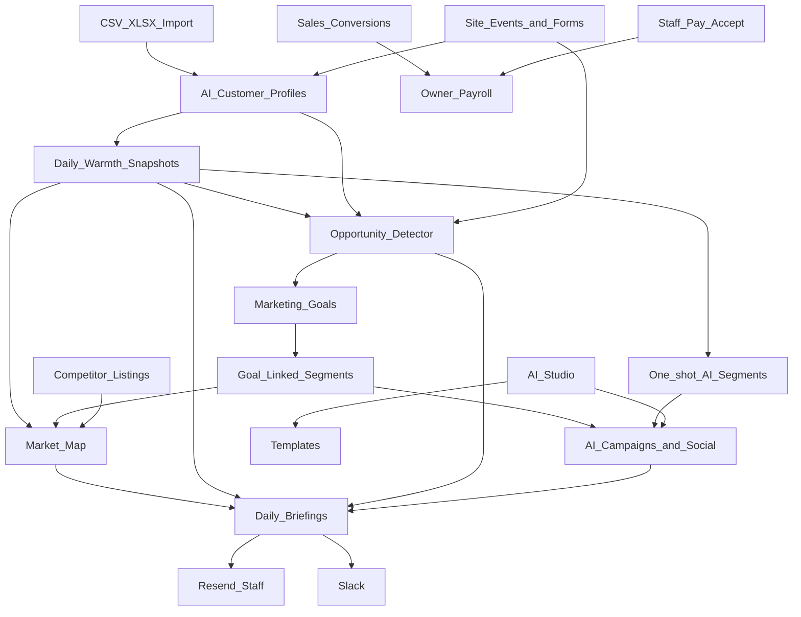
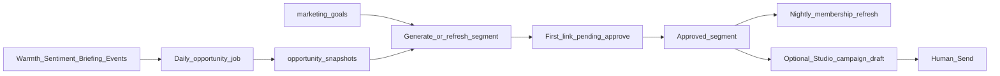

# Titan Imaging — Product Roadmap

> **Purpose:** Single reference for where the project is, where it is going, and how to keep working from any machine (including while waiting on API keys at your uncle’s).
>
> **Related docs:** [`implementation-plan.md`](../implementation-plan.md) (detailed build history) · [`deploy-staging.md`](deploy-staging.md) · [`production-cutover.md`](production-cutover.md) · [`Design.md`](../Design.md)

**Last updated:** August 2026  
**Stack:** Next.js 16 (Vercel) · FastAPI (Render) · Supabase · Resend · OpenRouter · Gemini (images) · Firecrawl (competitors) · Make (LinkedIn)

---

## 1. Status at a glance

| Phase | Name | Status |
|-------|------|--------|
| 1 | Foundation & public site | **Complete** |
| 2 | Backend, parts, forms | **Complete** |
| 3 | Admin auth, inventory CRUD, import, outreach | **Complete** |
| 4A | Campaigns, engagement, social, CRM | **Complete** |
| 4.5 | Design system & admin polish | **Complete** |
| **4B-A** | OpenRouter foundation (briefings + sentiment) | **Complete in code** |
| **4B-B** | Import-time AI profiles | **Complete in code** |
| **4B-C** | Engagement warmth snapshots | **Complete in code** |
| **4B-D** | AI-proposed segments | **Complete in code** |
| **4B-E** | AI email/social drafts | **Complete in code** |
| **4B-F** | Market Map (graph CRM) | **Complete in code** |
| **4B-G** | Daily AI briefings → email + Slack | **Complete in code** |
| **4B-H** | AI Studio (`/workbench` home) | **Complete in code** |
| **4B-I** | Staff payroll & sales commission | **Complete in code** |
| **4B-J** | Goals → opportunity segments | **Complete in code** |
| 4B-S3 | Competitor listings (Firecrawl) | **Complete in code** (needs `FIRECRAWL_API_KEY`) |
| Ops | Resend domain verify, Vercel transfer, staging | **In progress** |

**“Complete in code”** means implemented locally; activate with migrations + env vars (see §5). Push/pull the latest branch before working on another laptop.

---

## 2. Vision — the full loop



1. **Import & activity** feed AI customer profiles and briefings.  
2. **Warmth history** plus **opportunity detection** feed marketing **goals**.  
3. **Goals** keep linked segments refreshed; AI Studio drafts copy for those audiences.  
4. **Market Map** and **Daily Briefings** give staff a visual + narrative pulse.  
5. **Sales + payroll** track who earned what, with admin acceptance of pay terms.

---

## 3. Phase reference (4B AI + payroll)

### Phase A — OpenRouter foundation ✅

| Item | Detail |
|------|--------|
| **Scope** | OpenRouter client, per-customer AI briefing, contact/sell sentiment |
| **Backend** | `backend/app/ai/client.py`, `briefing.py`, `sentiment.py`, `jobs.py` |
| **API** | `GET/POST /api/v1/workbench/customers/{id}/briefing` |
| **UI** | Briefing card on `/workbench/customers/[id]` |
| **Env** | `OPENROUTER_API_KEY`, `AI_ENABLED=true` |

### Phase B — Import-time AI profiles ✅

| Item | Detail |
|------|--------|
| **Scope** | After CSV/XLSX customer import, background job enriches tags/notes and seeds briefing |
| **Backend** | `backend/app/ai/profile.py` |
| **Trigger** | `POST /api/v1/workbench/customers/import` (non–dry-run) |

### Phase C — Warmth history ✅

| Item | Detail |
|------|--------|
| **Scope** | Daily engagement score snapshots, warmer/colder movers |
| **DB** | `customer_engagement_snapshots` |
| **Backend** | `backend/app/ai/snapshots.py` |
| **API** | `POST /api/v1/workbench/ai/jobs/snapshots/manual`, `GET .../customers/{id}/warmth` |
| **Cron** | `POST /api/v1/workbench/ai/jobs/snapshots` + header `X-Cron-Secret` |

### Phase D — AI segments ✅

| Item | Detail |
|------|--------|
| **Scope** | AI proposes segment → human approves |
| **DB** | `segments.ai_managed`, `ai_proposal_status`, `ai_rationale` |
| **Backend** | `backend/app/ai/segments_ai.py` |
| **API** | `POST /api/v1/workbench/ai/segments/propose`, `.../approve`, `.../reject` |
| **UI** | `/workbench/segments` — “AI propose segment”, “Approve AI” |

### Phase E — AI campaign & social drafts ✅

| Item | Detail |
|------|--------|
| **Scope** | Generate email or LinkedIn copy via OpenRouter |
| **Backend** | `backend/app/ai/campaign_copy.py` |
| **API** | `POST /api/v1/workbench/ai/campaign/draft`, `.../social/draft` |
| **UI** | Use from AI Studio or wire into Templates/Campaigns as needed |

### Phase F — Market Map ✅

| Item | Detail |
|------|--------|
| **Scope** | Clickable CRM graph (customers, segments, parts, tags) — SQL-built, no LLM for layout |
| **Backend** | `backend/app/graph_crm.py` |
| **API** | `GET /api/v1/workbench/ai/graph?scope=market` |
| **UI** | `/workbench/insights` |

### Phase G — Daily briefings ✅

| Item | Detail |
|------|--------|
| **Scope** | AI daily report, store history, email staff + Slack |
| **DB** | `daily_briefings` |
| **Backend** | `backend/app/ai/daily_report.py` |
| **API** | `GET/POST /api/v1/workbench/ai/briefings/*`, cron `POST .../jobs/daily-briefing` |
| **UI** | `/workbench/briefings` |
| **Env** | `STAFF_BRIEFING_EMAILS`, `SLACK_WEBHOOK_URL`, `CRON_SECRET` |

### Phase H — AI Studio ✅

| Item | Detail |
|------|--------|
| **Scope** | `/workbench` home — IDE-style prompts, model dropdown, text + Gemini images, promote to template/social |
| **DB** | `ai_prompt_presets`, `ai_studio_runs` |
| **Backend** | `backend/app/ai/studio.py`, `images.py` |
| **API** | `/api/v1/workbench/ai/studio/*`, `/api/v1/workbench/ai/models`, `/api/v1/workbench/ai/prompts` |
| **UI** | `/workbench` (AI Studio) |
| **Env** | `OPENROUTER_API_KEY`, optional `GOOGLE_AI_API_KEY`, `AI_ALLOWED_MODELS` |

### Phase I — Staff payroll & sales ✅

| Item | Detail |
|------|--------|
| **Scope** | Admin profiles, tiers (Owner / Ops lead / Staff) + capabilities (marketing, sales, support, accounting, technician), pay packages, sales/hours, **service** jobs (repair + **PET/CT audit**), **adhoc** ledger, payroll graphs |
| **DB** | … `workbench_staff.workbench_tier`, `workbench_staff.capabilities`, `service_jobs`, `earnings_ledger` |
| **Backend** | … `staff_permissions.py`, `POST /admin/service-jobs`, `POST /admin/payroll/adhoc` |
| **UI** | **Titan Workbench** (`/workbench/*`) — Team role editor, filtered nav, `/workbench/service`, `/workbench/payroll` |
| **Env** | `OWNER_EMAILS` (comma-separated — uncle gets owner role) |
| **No OpenRouter required** | Payroll works without AI keys |

### Phase J — Goals → opportunity segments ✅

**Goal:** Turn AI customer understanding into **marketing goals** that continuously refresh the right people into the right segments — without inventing random segments every day.

| Item | Detail |
|------|--------|
| **Status** | Complete in code — migrate `20260823_0004`, run **Run opportunity detect** on Goals |
| **Depends on** | Warmth/sentiment improve quality; OpenRouter optional for segment name refine + campaign draft |
| **Env** | `CRON_SECRET` for nightly jobs; OpenRouter for AI refine/draft |

#### Opportunity types (examples)

| Type | Signals (rule + optional LLM label) | Typical goal |
|------|-------------------------------------|--------------|
| `warm_parts_inquiry` | High urgency contact/sell + part views + rising warmth | Same-day parts follow-up |
| `cooling_engaged` | Was warm / opened email; score falling; no conversion | 7-day re-engage |
| `sell_equipment` | Sell-form intent | Buy-side outreach |
| `consent_ready_nurture` | Marketing consent, low activity | Light nurture drip |
| `hot_lead` | Engagement score ≥ hot threshold | Staff alert + priority segment |

#### Automation loop



#### What to automate vs keep human

| Automate | Keep human |
|----------|------------|
| Nightly opportunity detection | Approve new goal → segment link |
| Refresh who is *in* an approved segment | Edit goal definitions / opportunity types |
| Flag empty or exploded segment counts | Send campaigns |
| Suggest campaign/Studio draft for a goal | Final copy and Send |

#### Data model

| Table | Purpose |
|-------|---------|
| `opportunity_snapshots` | `customer_id`, `opportunity_type`, `score`, `reasons` JSON, `as_of_date`, unique per customer/type/day |
| `marketing_goals` | `name`, `description`, `opportunity_types[]`, `channel`, `segment_id` / `pending_segment_id`, `auto_refresh`, `draft_on_threshold`, `segment_link_status` |

#### Backend / API

| Piece | Role |
|-------|------|
| `backend/app/ai/opportunities.py` | Rule-first detector |
| `backend/app/ai/goals.py` | Seed goals, generate/approve/refresh segment, draft campaign |
| `POST /api/v1/workbench/ai/jobs/opportunities[/manual]` | Detect opportunities |
| `POST /api/v1/workbench/ai/jobs/goals-refresh[/manual]` | Refresh auto_refresh goals |
| `CRUD /api/v1/workbench/goals` | Staff manage goals |
| `POST /api/v1/workbench/goals/{id}/generate-segment` | Propose linked segment (pending) |
| `POST /api/v1/workbench/goals/{id}/approve-segment` | Approve + attach |
| `POST /api/v1/workbench/goals/{id}/draft-campaign` | Email draft JSON (human Send) |
| `GET /api/v1/workbench/customers/{id}/opportunities` | Latest opportunity chips |

Segment `filter_json` supports `opportunity_types` + `opportunity_max_age_days` (see `backend/app/segments.py`).

#### Frontend

| Screen | Behavior |
|--------|----------|
| `/workbench/goals` | Goal list, create, detect, generate/approve/refresh, draft campaign |
| Customer detail | Opportunities chips when snapshots exist |
| Nav | CRM → Goals |

#### Seed goals (ship with defaults)

1. Re-engage cooling GE parts leads (7 days)  
2. Hot leads — staff priority  
3. Sell-to-us inquiries  
4. Consent-ready nurture  

#### Out of Phase J

- Auto-send campaigns without human Send  
- Unsupervised new goals invented daily without approval  
- Inferring opportunities from competitor scrape (Sprint 3 can feed later)

### Sprint 3 — Competitor intelligence (Firecrawl) ✅ / activating

| Item | Detail |
|------|--------|
| **Scraper** | **Firecrawl** — `FIRECRAWL_API_KEY`, `POST /v2/scrape` (markdown + JSON extract) |
| **Scope** | Source URLs → scrape → normalize → compare vs Titan → Market Map nodes |
| **DB** | `competitor_sources`, `competitor_listings` (`20260823_0005`) |
| **Backend** | `backend/app/competitors/` |
| **API** | `/api/v1/workbench/competitors/*` + `POST /admin/ai/jobs/competitors-scrape` |
| **UI** | `/workbench/competitors` (Inventory) |

Seed sources ship **inactive** with placeholder catalog URLs — edit to real pages, activate, then scrape.

---

## 4. Workbench map

Navigation is **grouped** (AI · CRM · Marketing · Sales & Pay · Inventory) and **filtered by staff tier/capabilities** — see [`frontend/lib/admin-nav.ts`](../frontend/lib/admin-nav.ts). Product name: **Titan Workbench** (URLs remain `/workbench/*`).

### Staff tiers & capabilities

| Tier (display) | `workbench_tier` | Capabilities |
|----------------|--------------|--------------|
| Owner | `owner` | All |
| Ops lead | `admin` | marketing, sales, support, technician (not accounting / team CRUD) |
| Staff | `staff` | Explicit checkboxes only |

| Capability | Typical access |
|------------|----------------|
| marketing | AI Studio, campaigns, templates, social, outreach |
| sales | Sales conversions, CRM, inventory, Market Map |
| support | CRM, service jobs, inventory |
| technician | Service / audits |
| accounting | Payroll dashboard, ledger, adhoc pay |

Assign roles on **Team** (owner only).

| URL | Purpose | Nav group |
|-----|---------|-----------|
| `/workbench` | **AI Studio** — prompts, models, generate, promote | AI |
| `/workbench/live` | Live sessions + hot leads | AI |
| `/workbench/insights` | Market Map | AI |
| `/workbench/briefings` | Daily AI reports | AI |
| `/workbench/customers` | CRM list + import | CRM |
| `/workbench/customers/[id]` | 360 timeline + AI briefing (+ opportunities in Phase J) | CRM |
| `/workbench/segments` | Segments + AI propose/approve | CRM |
| `/workbench/goals` | Marketing goals → opportunity segments | CRM |
| `/workbench/templates` | Email templates | Marketing |
| `/workbench/campaigns` | Email campaigns | Marketing |
| `/workbench/social` | LinkedIn queue → Make | Marketing |
| `/workbench/outreach` | One-off email blasts | Marketing |
| `/workbench/sales` | Log conversions | Sales & Pay |
| `/workbench/service` | Field service / repair jobs at customer sites | Sales & Pay |
| `/workbench/team` | Staff roster + assign pay package | Sales & Pay |
| `/workbench/my-pay` | Accept commission/hourly terms | Sales & Pay |
| `/workbench/payroll` | Owner dashboard (charts) | Sales & Pay |
| `/workbench/parts` | Inventory | Inventory |
| `/workbench/competitors` | Competitor scrape (Firecrawl) + price compare | Inventory |
| `/workbench/categories` | Part categories | Inventory |
| `/workbench/import` | Parts bulk import | Inventory |
| `/workbench/alerts` | Back-in-stock subscribers | Inventory |

---

## 5. API keys & activation checklist

Use this at your uncle’s when keys are ready.

### 5.1 Database migrations

On **local**, **staging**, and **production** Render:

```bash
cd backend
source .venv/Scripts/activate   # Git Bash on Windows
alembic upgrade head
```

Expected head revisions (August 2026):

| Revision | File |
|----------|------|
| `20260822_0001` | RLS enable |
| `20260823_0001` | Briefings + sentiment columns |
| `20260823_0002` | Snapshots, daily briefings, AI studio tables |
| `20260823_0003` | Payroll tables |
| `20260823_0004` | `opportunity_snapshots`, `marketing_goals` |
| `20260823_0005` | `competitor_sources`, `competitor_listings` |
| `20260823_0006` | `service_jobs` (field service → `service` ledger) |
| `20260823_0007` | audit scheduling + `audit_report` intake on `service_jobs` |
| `20260823_0008` | `workbench_staff.workbench_tier` + `capabilities` (Workbench RBAC) |
| `20260823_0009` | rename `admin_staff` to `workbench_staff`, `staff_tier` to `workbench_tier` |

### 5.2 Backend env (Render + local `backend/.env`)

Copy from [`backend/.env.example`](../backend/.env.example).

| Variable | Required for | Notes |
|----------|----------------|-------|
| `OPENROUTER_API_KEY` | Phases A–H text AI | Get at [openrouter.ai](https://openrouter.ai) |
| `AI_ENABLED=true` | All AI features | Default true; set false to disable gracefully |
| `AI_MODEL_DEFAULT` | Fallback model | e.g. `openai/gpt-4o-mini` |
| `AI_ALLOWED_MODELS` | Studio dropdown | Comma-separated OpenRouter model IDs |
| `GOOGLE_AI_API_KEY` | Phase H images only | Gemini image gen; text still uses OpenRouter |
| `STAFF_BRIEFING_EMAILS` | Phase G email | Comma-separated; else uses allowlist |
| `SLACK_WEBHOOK_URL` | Phase G Slack | Incoming webhook URL |
| `CRON_SECRET` | Render cron jobs | Random string; header `X-Cron-Secret` |
| `OWNER_EMAILS` | Phase I owner role | Uncle’s email for Payroll access |
| `FIRECRAWL_API_KEY` | Sprint 3 competitors | [firecrawl.dev](https://www.firecrawl.dev) API key |
| `FIRECRAWL_BASE_URL` | Sprint 3 (optional) | Default `https://api.firecrawl.dev` |
| `RESEND_API_KEY` | Email send | Already used for campaigns |
| `ADMIN_EMAIL_ALLOWLIST` | Admin login | Comma-separated Google emails |

After changing Render env: **restart the API service**.

### 5.3 Verify AI is live

1. Sign in at `/workbench/login`.  
2. Open `/workbench` — banner should disappear when configured.  
3. `GET /api/v1/workbench/ai/status` → `"configured": true`.  
4. Generate text in AI Studio (small prompt).  
5. Open a customer → Briefing loads or regenerates.

### 5.4 Verify payroll (no AI keys needed)

1. Set `OWNER_EMAILS=uncle@...` and restart API.  
2. `/workbench/team` → **Create default pay package** → assign to admins.  
3. Each admin → `/workbench/my-pay` → **Accept terms**.  
4. `/workbench/sales` → log a test conversion.  
5. `/workbench/payroll` → charts + owed amounts (owner only).

### 5.5 Render cron (optional, Phase G + C)

| Job | Method | URL | Schedule |
|-----|--------|-----|----------|
| Engagement snapshots | POST | `/api/v1/workbench/ai/jobs/snapshots` | Daily 00:05 UTC |
| Opportunity detect | POST | `/api/v1/workbench/ai/jobs/opportunities` | Daily 00:15 UTC |
| Goals refresh | POST | `/api/v1/workbench/ai/jobs/goals-refresh` | Daily 00:30 UTC |
| Daily briefing | POST | `/api/v1/workbench/ai/jobs/daily-briefing` | Daily 06:00 UTC |

Header: `X-Cron-Secret: <CRON_SECRET>`

---

## 6. What works without API keys

You can develop and demo these **today** without OpenRouter/Gemini:

- Entire public site, parts search, contact/sell forms  
- Admin inventory, customers, campaigns, segments (manual), social composer  
- Live dashboard + hot leads (engagement scoring)  
- AI Studio UI, Market Map, Briefings UI (shows “not configured” until keyed)  
- **Full payroll flow** (team, accept terms, sales, payroll charts)

These **need** `OPENROUTER_API_KEY`:

- Briefings, sentiment, import enrichment, AI segments, drafts, daily report narrative, Studio text gen  
- **Phase J** opportunity refine + goal→segment generation (rules can run partially without LLM)

These **need** `GOOGLE_AI_API_KEY`:

- Studio image generation only

---

## 7. Pull latest on your laptop (uncle visit workflow)

### 7.1 One-time setup

```bash
git clone https://github.com/cyberroa/titan-imaging.git
cd titan-imaging
git checkout staging    # or the branch with latest AI/payroll work
```

```bash
# Backend
cd backend
python -m venv .venv
source .venv/Scripts/activate    # Git Bash on Windows
pip install -r requirements.txt
cp .env.example .env             # fill from password manager / Render dashboard

# Frontend
cd ../frontend
npm install
cp .env.example .env.local
```

### 7.2 Every session

```bash
git pull origin staging
cd backend && source .venv/Scripts/activate && alembic upgrade head
cd ../frontend && npm install   # if package.json changed
```

Two terminals:

```bash
# Terminal 1 — API
cd backend && source .venv/Scripts/activate
python -m uvicorn app.main:app --reload --port 8000

# Terminal 2 — Frontend
cd frontend && npm run dev
```

Open http://localhost:3000/workbench

### 7.3 Shell note (Windows)

Use **Git Bash** for all git and project commands (repo rule). Example:

```bash
"/c/Program Files/Git/bin/bash.exe" -lc 'cd ~/Documents/GitHub/titanimaging && git pull'
```

---

## 8. Recommended next work (priority order)

While waiting on keys:

1. **Commit & push** current AI + payroll work to `staging` if not already on remote.  
2. Run **migrations** on staging Supabase + Render staging API.  
3. **Payroll dry run** with uncle: create package, assign, accept, log fake sale, review Payroll page.  
4. Polish **AI Studio** presets and default prompts for Titan’s voice.  
5. **Sprint 3** competitors: set `FIRECRAWL_API_KEY`, edit scrape URLs on `/workbench/competitors`, scrape, review compare + Market Map.  
6. Read through [`deploy-staging.md`](deploy-staging.md) if staging isn’t fully wired.

When keys arrive:

1. Set `OPENROUTER_API_KEY` on Render → restart → test Studio + one briefing.  
2. Set `OWNER_EMAILS` + payroll smoke test.  
3. Optional: `GOOGLE_AI_API_KEY`, Slack, cron jobs (`/workbench/ai/jobs/competitors-scrape`).  
4. Set `FIRECRAWL_API_KEY` and activate competitor sources.

---

## 9. Migrations reference

| Migration | Tables / changes |
|-----------|------------------|
| `20260413_0001_init` | parts, categories, contact/sell submissions |
| `20260418_0001_phase4a` | customers, segments, templates, campaigns, events, social |
| `20260822_0001` | RLS policies |
| `20260823_0001` | `customer_briefings`, sentiment columns |
| `20260823_0002` | snapshots, daily_briefings, ai_prompt_presets, ai_studio_runs, segment AI columns |
| `20260823_0003` | payroll tables |
| `20260823_0004` | opportunity_snapshots, marketing_goals |
| `20260823_0005` | competitor_sources, competitor_listings |

---

## 10. Branch & deploy workflow

```
feature branch → PR → staging → test Preview URL → PR → main (production)
```

- **Frontend:** Vercel, root `frontend/`  
- **Backend:** Render, `backend/`  
- **DB:** Supabase Postgres, Alembic from Render or local with `DATABASE_URL`

---

## 11. Out of scope (later)

- Autonomous campaign send without human review  
- Unsupervised new goals invented daily without approval (Phase J keeps human approve on new goal→segment links)  
- ACH / automatic commission payout  
- Full HR/tax payroll  
- Competitor scrape via Firecrawl (Sprint 3 — in code; needs `FIRECRAWL_API_KEY`)  
- GraphQL ad-hoc analytics layer  
- Custom model fine-tuning

---

## 12. Quick links

| Doc | Use when |
|-----|----------|
| [`implementation-plan.md`](../implementation-plan.md) | Historical phase detail, schema notes |
| [`backend/.env.example`](../backend/.env.example) | All backend env vars |
| [`backend/README.md`](../backend/README.md) | API local setup |
| [`docs/phase4a-make-setup.md`](phase4a-make-setup.md) | LinkedIn / Make |
| [`docs/deploy-staging.md`](deploy-staging.md) | Staging environment |
| [`docs/production-cutover.md`](production-cutover.md) | Go-live checklist |
